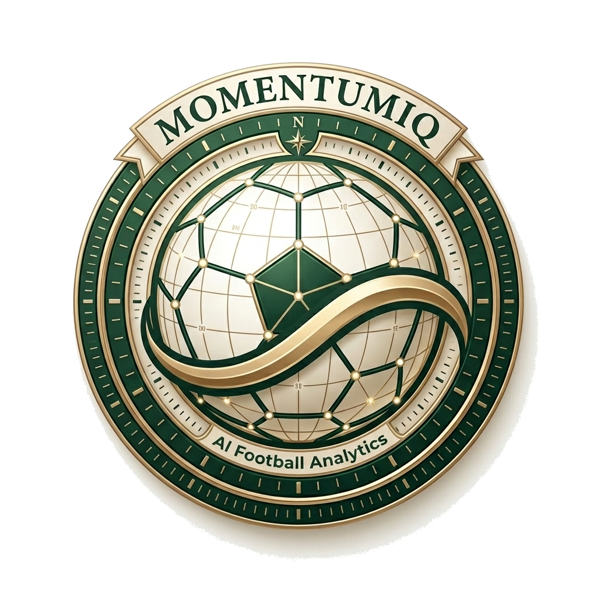

<div align="center">

# MomentumIQ

### *Demystifying match dynamics, explaining football intelligently.*

[](https://www.python.org/)
[](https://nodejs.org/)
[](https://vite.dev/)
[](https://ollama.com/)
[](https://github.com/DS4SD/docling)
[](LICENSE)

<br />

<br />
<br />

MomentumIQ is a premium, human-centered football intelligence companion and interactive journal built for the FIFA World Cup. By translating complex match telemetry, tactical formations, and spatial coordinates into clear, structured narratives, MomentumIQ bridges the gap between raw data and the beautiful game.

</div>

---

## 💡 The Problem We Are Solving

Modern football produces millions of data points per second, yet the global community faces two massive bottlenecks in understanding the sport:

### 1. The Explanation Gap (Dry Statistics vs. Tactical Context)
Traditional sports dashboards rely on static, descriptive stats (e.g., *Possession: 54%*, *Total Passes: 412*). These metrics tell you **what** happened, but fail to explain **why**:
* They cannot identify why match momentum shifted.
* They fail to explain how a tactical substitution closed a passing channel.
* They cannot measure how physical fatigue affects pass success rates under pressure.

### 2. The Trust Gap (Opaque VAR Decision-Making)
Video Assistant Referee (VAR) reviews determine World Cup outcomes but remain completely opaque. Fans, journalists, and players only see raw lines drawn on a screen, with no explanation of the rule interpretation. This opacity breeds polarization, frustration, and distrust in refereeing standards.

---

## ⚽ Why It Matters: Context of Soccer and the World Cup

During the FIFA World Cup, billions of fans experience the same matches. MomentumIQ levels the playing field by providing a **human-centered explainer system**:

* 📊 **Democratizing Elite Analytics:** Translates institutional-grade metrics (usually locked behind expensive professional paywalls) into high-end, magazine-style interactive stories accessible to casual fans.
* 🛡️ **Restoring Trust in Refereeing:** Demystifies high-stakes World Cup controversies (like Ao Tanaka's goal-line check or Lautaro Martinez's offside margin) by aligning the incident directly with official **IFAB Laws of the Game**.
* 📋 **Interactive Tactical Learning:** Provides an interactive playground where fans can simulate plays on a whiteboard and have an AI Tactical Companion explain the geometric strengths and weaknesses of their formation.

---

## 🌍 Real-Time FIFA World Cup 2026 API Integration

Unlike platforms that rely solely on static historical datasets, MomentumIQ is designed for the future. We integrated a real-time data connection to the public **FIFA World Cup 2026 API**:

* ⚡ **Live Real-Time Scoreboards:** Automatically fetches match updates, current scores, and elapsed time directly from the live feed (`https://worldcup26.ir/get/games`).
* 📅 **Dynamic Matchday Bulletin:** The Home page acts as a living matchday hub, dynamically computing the active matchday. It displays any matches that are currently live (once kicked off) and lists all upcoming matches scheduled for that active day.
* 🏆 **Match Outcome Tracking:** Filters out completed matches from the Home board to keep the visual feed clean and focused on active play. Complete match histories, final outcomes, goal scorers, and detailed play analysis are moved to the **Match Explorer** database.
* 💾 **Smart Offline Fallback Cache:** Implements a caching mechanism that saves responses locally. If the public API encounters network delays or timeouts, the application seamlessly falls back to cached data, ensuring 100% uptime and offline-first reliability.

---

## 🧠 AI & Technical Approach

MomentumIQ utilizes a hybrid AI architecture that combines local machine learning predictions, RAG-guided document retrieval, and localized reasoning engines:

```mermaid
graph TD
    A[StatsBomb Match Telemetry] --> B(scikit-learn ML Engine)
    C[IFAB Laws of the Game PDF] --> D(IBM Docling Parser)
    B -->|xP & Fatigue Metrics| E[FastAPI Local Server]
    D -->|Parsed Rule RAG| E
    E -->|Model Context Protocol| F[Local Ollama: Granite 3.3 2B]
    F -->|Reasoning & Narrative| G[Vite + React Dashboard]
    H[Interactive Whiteboard] -->|x,y Coordinates| E
    style F fill:#ff9900,stroke:#333,stroke-width:2px
    style D fill:#008080,stroke:#333,stroke-width:2px
    style G fill:#0D2C1E,stroke:#d2b48c,stroke-width:2px
```



### 1. Local Language Model: IBM Granite 3.3 2B (via Ollama)
To guarantee 100% private, low-latency, and cost-efficient execution, we run a local reasoning model (**IBM Granite 3.3 2B**) on device. It consumes match states, coordinate lists, and rule queries to formulate professional narratives.

### 2. Semantic Document Ingestion: IBM Docling
We use **IBM Docling** to parse the official PDF of the **IFAB Laws of the Game** into structured markdown. By parsing the rules document, we can run highly targeted semantic RAG lookups, grounding every referee verdict with the exact law text (e.g., Law 11 for Offsides, Law 12 for Fouls and Misconduct).

### 3. Grounded & Explainable AI (XAI) Prompting
To avoid LLM hallucinations, every query response returned by the AI is strictly structured under three diagnostic pillars:
* **Confidence Score:** A percentage showing how certain the AI is based on the available telemetry facts.
* **Grounding Facts:** The exact statistics or milestones used to answer.
* **Reasoning Path:** The step-by-step logic path followed by the model under IFAB parameters.

### 4. Machine Learning Engines (scikit-learn)
* **Expected Pass Completion (xP):** A logistic regression classifier trained on StatsBomb World Cup data that projects pass success probability based on distance, angle, target locations, and defensive pressure.
* **Fatigue Model:** A linear regression model that projects player fatigue curves based on high-intensity runs, distance covered, and sprint decay.

---

## 🎨 Interactive Product Features

### 📊 1. Match Story & Insights (Dashboard)
* **Dominance Intensity Curve:** An interactive, Sofascore-style game flow chart mapping attack pressures. Clicking on milestone flags (goals, red cards, substitutions) prompts Granite AI to run RAG lookups and analyze the tactical shift.
* **Chapter-Based Match Log:** Matches are broken down into interactive chapters (First Half, Turning Points, Tactical Shifts). Includes a twin-pitch visualizer demonstrating player positioning before and after key tactical shifts.

### 🔍 2. VAR Explainer Room
* **Scenario Deconstructor:** Select controversial historical incidents or upload custom PNG/JPG screenshots of match moments.
* **AI Pitchside Monitor:** Plays back spatial tracks and body outlines. Generates a multi-step rule evaluation path.
* **TTS Narration:** Features a built-in voice synthesizer that narrates the AI referee verdict, complete with a live equalizer animation.

### 📋 3. AI Tactical Whiteboard Companion
* **11-a-Side Drag-and-Drop:** Map custom tactical setups by dragging player and ball tokens on a virtual turf pitch.
* **Analyst Mode (Coordinates API):** The AI reads the exact `(x, y)` positions of all 22 players to analyze compactness, passing channels, and positioning weaknesses.
* **Fan Mode (Grounded RAG):** Ask anything about the active match, and the AI replies with a structured breakdown showing its *Confidence Score*, *Grounding Facts*, and *Reasoning Path*.

### 📈 4. Stress & Performance Monitor
* **Spatial Press Heatmaps:** Visualizes player defensive pressure events across three distinct zones (Defensive Zone, Midfield Battleground, Attacking Zone).
* **Tug-of-War Telemetry:** Translates pressure map density into a "Tug-of-War" comparison card, explaining tactical dominance in clear terms.

---

## 📂 Repository Structure

```
momentum-iq/
├── backend/
│   ├── main.py            # FastAPI main server & API endpoints
│   ├── worldcup2026.py    # World Cup 2026 live API & cache layer
│   ├── flows_orchestrator.py # AI reasoning prompt engines
│   ├── analyzer.py        # StatsBomb telemetry analyzers & curves
│   ├── ml_engine.py       # scikit-learn models (xP, Fatigue)
│   └── cache/             # Local offline cached matches
├── src/
│   ├── components/        # UI Views (Dashboard, TacticalBoard, VarRoom)
│   ├── assets/            # App branding, favicon, and logo assets
│   ├── App.jsx            # Main router and dashboard state coordinator
│   └── index.css          # Theme tokens & global styles (Warm Ivory, Forest Green)
├── public/                # Favicon and static files
├── index.html             # App entry point
└── package.json           # Frontend dependencies
```

---

## Getting Started

> [!IMPORTANT]
> **System Requirements:** Ensure you have **Python 3.10+** and **Node.js v18+** installed on your system. MomentumIQ runs all models locally for privacy and cost efficiency.

### 1. Model Setup
Download and start **Ollama**, then fetch the Granite model:
```bash
ollama run granite3.3:2b
```

### 2. Backend Installation & Run
From the project root directory, install Python dependencies and start FastAPI:
```bash
# Install dependencies
pip install fastapi uvicorn pandas scikit-learn statsbombpy docling requests

# Start backend dev server
python backend/main.py
```
*The backend API will be live at `http://127.0.0.1:8000`.*

### 3. Frontend Installation & Run
Open a new terminal window at the project root directory, install packages, and start Vite:
```bash
# Install packages
npm install

# Start frontend client dev server
npm run dev
```
*Open `http://localhost:5173` in your browser.*

---

## 📄 License

This project is licensed under the **MIT License** - see the [LICENSE](LICENSE) file for details.

---

<p align="center">Made with ❤️ by Me/p>
